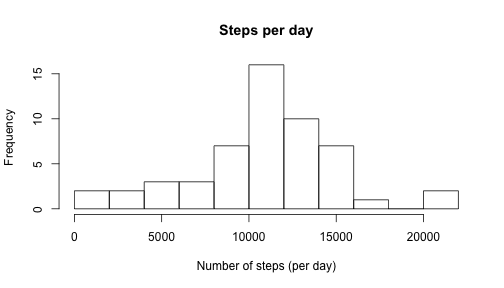
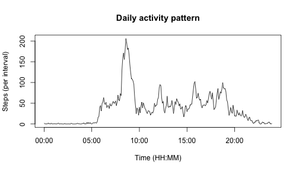
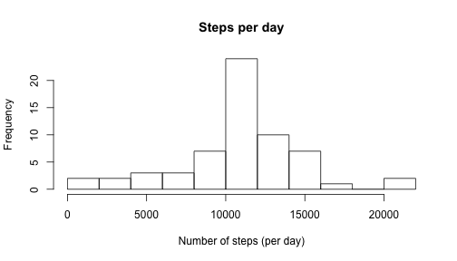
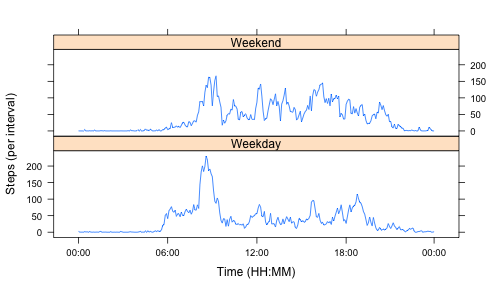

# Reproducible Research: Peer Assessment 1

This assignment makes use of data from a personal activity monitoring device. This device collects data at 5 minute intervals through out the day. The data consists of two months of data from an anonymous individual collected during the months of October and November, 2012 and include the number of steps taken in 5 minute intervals each day.

The variables included in this dataset are:

1. steps: Number of steps taking in a 5-minute interval (missing values are coded as NA)
2. date: The date on which the measurement was taken in YYYY-MM-DD format
3. interval: Identifier for the 5-minute interval in which measurement was taken

The dataset is stored in a comma-separated-value (CSV) file and there are a total of 17,568 observations in this dataset.
## Loading and preprocessing the data

Unzip the `activity.zip` file found in the repository to produce the `acitivty.csv` file. The following code then loads the data and sets the appropraite data types.


```r
data <- read.csv("activity.csv", stringsAsFactors = FALSE)
data$steps <- as.numeric(data$steps) # Make steps numeric
data$date <- as.Date(data$date, format = "%Y-%m-%d") # Make dates dates
data$interval <- as.numeric(data$interval) # Make intervals numeric
```

## What is mean total number of steps taken per day?

The following code takes the data with a valid step count and aggregates it at a daily level.


```r
dataWithSteps <- subset(data, !is.na(data$steps))
dailySteps <- tapply(dataWithSteps$steps, dataWithSteps$date, FUN = sum)
```

Plotting the results shows a normal distribution of steps, centered at around 11000 per day. We use the interval start times instead of the interval names on the x axis.


```r
hist(dailySteps, 
     breaks = 15, 
     main = "Steps per day", 
     xlab = "Number of steps (per day)" )
```

 

The mean steps per day is calculated as follows.


```r
mean(dailySteps)
```

```
## [1] 10766
```

The median steps per day is calculated as follows.


```r
median(dailySteps)
```

```
## [1] 10765
```


## What is the average daily activity pattern?

The following code takes the data with a valid step count and averages it at a per-interval level. It creates a separate vector to hold the interval start times.


```r
meanIntervalSteps <- tapply(dataWithSteps$steps, dataWithSteps$interval, FUN = mean)
intervalNames <- as.POSIXlt(
    gsub(" ", "0", sprintf("%04s", names(meanIntervalSteps))), 
    format = "%H%M")
```

Plotting the results shows a peak of around 200 steps per interval at around 8:30 am. 


```r
plot(intervalNames, meanIntervalSteps, type = "l",
     main = "Daily activity pattern",
     xlab = "Time (HH:MM)",
     ylab = "Steps (per interval)")
```

 

The maximum number of steps per interval is calculated as follows.


```r
max(as.numeric(meanIntervalSteps))
```

```
## [1] 206.2
```

The interval start time at which this occurs is calculated as follows.


```r
intervalNum <- 
    which(max(as.numeric(meanIntervalSteps)) == as.numeric(meanIntervalSteps))
names(meanIntervalSteps[intervalNum])
```

```
## [1] "835"
```

This corresponds to the interval that starts at 8:35 am.

## Imputing missing values

The number of intervals with a missing step count is calculated as follows.


```r
nrow(data[is.na(data$steps),])
```

```
## [1] 2304
```

We can create a new data frame to hold the mean steps per interval across all days. This only uses data with a valid step count.


```r
intMean <- data.frame(cbind(names(meanIntervalSteps), as.vector(meanIntervalSteps)))
names(intMean) <- c("interval", "steps")
```

We then merge this data with the raw data so that any NA values are replaced with the average for that inteval across all days.


```r
merged <- merge(data, intMean, by.x = "interval", by.y = "interval", all.x = TRUE)
merged[is.na(merged$steps.x),"steps.x"] <- 
    as.vector(merged[is.na(merged$steps.x),"steps.y"]) 
```

Data types are tidied up a follows.


```r
merged$steps.x <- as.numeric(merged$steps.x)
merged$date <- as.Date(merged$date, format = "%Y-%m-%d")
merged$interval <- as.numeric(merged$interval)
```

We can then aggregate the merged data to a daily level as follows.


```r
mergedDailySteps <- tapply(merged$steps.x, merged$date, FUN = sum)
```

Plotting the data shows that our (rather simple) imputing has not changed the shape of the distrubution, but has increased the overall number of steps. 


```r
hist(mergedDailySteps, 
     breaks = 15, 
     main = "Steps per day", 
     xlab = "Number of steps (per day)" )
```

 

Using the merged data, the mean number of steps per day is calculated as follows.


```r
mean(mergedDailySteps)
```

```
## [1] 10766
```

Using the merged data, the median number of steps per day is calculated as follows.


```r
median(mergedDailySteps)
```

```
## [1] 10766
```

The mean remains the same after imputing while the median is slightly increased.

## Are there differences in activity patterns between weekdays and weekends?

The following code uses the data set with imputed values and creates an new data set showing the mean number of steps per interval for all days, split by day type (weekday or weekend). 


```r
dayType <- rep("Weekday", nrow(merged))
dayType[which(weekdays(merged$date) %in% c("Saturday", "Sunday"))] <- "Weekend"
merged <- cbind(merged, dayType)

meanMergedSteps <- 
    aggregate(merged$steps.x, by = list(merged$interval, merged$dayType), FUN = mean)

names(meanMergedSteps) <- c("interval","dayType", "steps")

meanMergedSteps$interval <- as.POSIXct(
    gsub(" ", "0", sprintf("%04s", meanMergedSteps$interval)), 
    format = "%H%M")

meanMergedSteps <- 
    meanMergedSteps[order(meanMergedSteps$interval, meanMergedSteps$dayType),]
```

The following code plots the average time profile of steps across all days for weekdays and weekends, using the data set with imputed values. We use the interval start times instead of the interval names on the x axis.


```r
x_lab = c("00:00", "06:00", "12:00", "18:00", "00:00")
x_at <- as.POSIXct(x_lab,format = "%H:%M")
x_at[5] <- max(meanMergedSteps$interval)

library(lattice)
xyplot(steps ~ as.POSIXct(interval,format = "%H%M") | dayType, 
       data = meanMergedSteps,
       layout = c(1, 2), 
       type = "l",
       xlab = "Time (HH:MM)",
       ylab = "Steps (per interval)",
       scale = list(x = list(at = x_at, labels = x_lab)))
```

 
